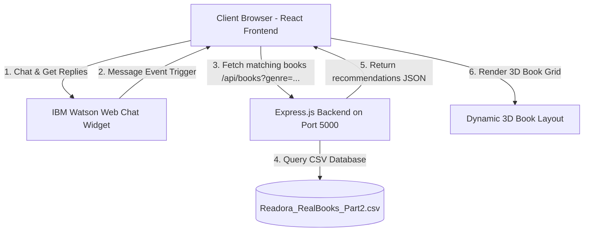

# 🤖 Readora — AI-Powered Book Recommendation Chatbot (React + Node Full Stack)

**Readora** is a premium, full-stack book recommendation chatbot designed to help readers discover books they will love through natural conversations. Powered by **IBM Watson Assistant** and a local database, Readora analyzes how a user is feeling or what genre they are interested in and displays recommendations in an interactive dashboard featuring animated **3D physical book cards**.

The project is structured as a professional, production-grade full-stack application (similar to a standard enterprise React + Express setup).

---

## 🌟 Key Features

*   **IBM Watson Web Chat Integration:** Loads the official Watson Web Chat widget dynamically and listens to Watson's responses client-side. When you chat with Watson, the React frontend catches message triggers, queries the Express API, and updates the recommendation grid.
*   **3D Physical Book Cards:** Implements a premium, physical 3D book hover animation in pure CSS, complete with spines, cover title labels, and tilt angles that respond to cursor movement.
*   **Vibe Filter Dashboard:** Allows users to manually filter and explore books across 5 core genres (Fantasy, Romance, Sci-Fi, Thriller, Horror) using clean, responsive dashboard controls.
*   **Dual-Server Dev Workflow:** Uses `concurrently` to boot both the React dev server (Vite, port 5173) and the Express backend (port 5000) with a single root command.
*   **Dynamic CSV Parser:** Automatically reads and parses the structured 50-book dataset (`Readora_RealBooks_Part2.csv`) on startup using a custom quote-safe CSV scanner.
*   **Cozy Library Theme:** Warm, airy light theme with soft background gradient orbs and micro-animations styled around book-lover aesthetics.

---

## 📐 System Architecture



---

## 🚀 Quick Start Guide

### 1. Prerequisites
Make sure you have [Node.js](https://nodejs.org/) (v16 or higher) and `npm` installed on your system.

### 2. Installation
Clone the repository and install all dependencies in one command:
```bash
git clone https://github.com/Rimjhim117/readora_chatbot.git
cd Readora
npm run install-all
```
This script will automatically install npm modules for the root directory, the `frontend/` folder, and the `backend/` folder.

### 3. Run the Development Servers
Start both the React frontend and the Express backend concurrently:
```bash
npm run dev
```
Open [http://localhost:5173](http://localhost:5173) in your web browser. The frontend will automatically proxy all API requests to the Express server running on port 5000.

### 4. Build for Production
To bundle the React app for production deploy, run:
```bash
npm run build
```
Vite will compile the React code and deposit it straight into the `backend/public/` folder, allowing the Express server to serve the full project standalone on Port 5000.

---

## 🤖 IBM Watson Assistant Setup Guide

To configure your Watson Assistant instance:

1.  **Watson Assistant Resource:** Create a Watson Assistant service on your IBM Cloud account.
2.  **Web Chat Integration:**
    *   In Watson Assistant, navigate to **Integrations** and select **Web Chat**.
    *   Find the HTML embed code block.
    *   Copy the `integrationID`, `region`, and `serviceInstanceID` parameters.
3.  **Environment Configuration:**
    *   Open `backend/.env` and update the Watson configurations:
        ```env
        PORT=5000
        WATSON_INTEGRATION_ID=your_integration_id
        WATSON_REGION=your_region_code (e.g., au-syd)
        WATSON_SERVICE_INSTANCE_ID=your_service_instance_id
        WATSON_ASSISTANT_ID=your_assistant_id
        ```
    *   Restart the server. The React frontend will dynamically pull these values from the backend `/api/watson-config` service and initialize the floating widget.

---

## 📁 File Structure

```text
Readora/
├── backend/                     # Node.js + Express backend server (Port 5000)
│   ├── public/                  # Compiled React production assets served by Express
│   ├── .env                     # Local environment variables configuration
│   ├── .env.example             # Environment variables template
│   ├── Readora_RealBooks_Part2.csv # Real book dataset (CSV database)
│   ├── server.js                # Express API and configurations service
│   └── package.json             # Backend npm modules configuration
├── frontend/                    # Vite + React frontend project
│   ├── src/                     # React source files (App.jsx, main.jsx, index.css)
│   ├── index.html               # Main page layout & SEO tags
│   ├── vite.config.js           # Vite server, proxy, and build targets config
│   └── package.json             # Frontend npm modules configuration
├── package.json                 # Root script runner orchestrator
└── README.md                    # Project documentation
```

---

## 👩‍💻 Author

- **Rimjhim Srivastava**  
  GitHub: [rimjhim117](https://github.com/rimjhim117)  
  Developer of Readora – AI Book Recommendation Chatbot
